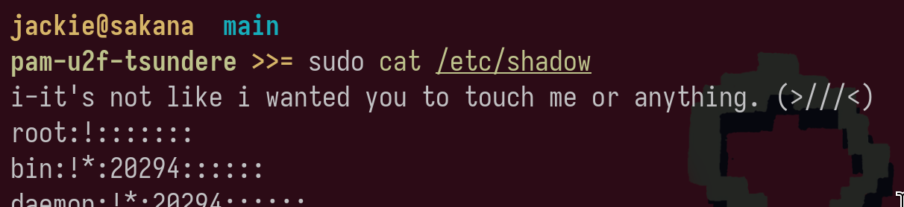

# pam-u2f-tsundere

it's not like i wanted to authenticate you or anything!! ugh

a fork of [pam-u2f](https://github.com/Yubico/pam-u2f) that replaces the cue prompt with randomized tsundere messages


## usage

build and install as you would pam-u2f, then in your PAM config:

```
auth sufficient pam_u2f.so cue
```

do not set cue_prompt. that's the whole point. baka.

## syncing with upstream
```bash
git fetch upstream
git rebase upstream/master
```

## license

same as upstream ... not that i even care!
